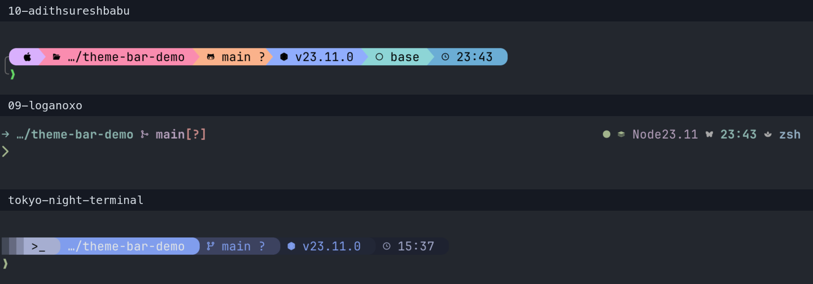

# cmux + Starship Terminal Setup

A personal selection of ready-to-use cmux colors and Starship prompts. Choose each independently. Contributions are welcome.

## Use

From this repository on macOS:

```sh
./cmux-theme         # choose terminal colors
./starship-theme     # choose a shell prompt
```

Or apply a choice directly:

```sh
./cmux-theme slate
./starship-theme 10-adithsureshbabu
```

cmux themes require cmux and Python 3.10+. The included terminal configs use JetBrainsMono Nerd Font Mono; install that font first. Starship styles also require Starship initialized in your zsh shell. Open a new cmux shell to see the prompt.

- **cmux:** background, text colors, font, cursor, and app appearance. Changing it leaves your prompt alone.
- **Starship:** prompt layout, icons, and colors. Changing it leaves your terminal theme alone.

Codex and Claude use their own settings. These commands do not install or select application-specific themes, restart apps, or interrupt running jobs.

## A few favorites

Selected real cmux screenshots, cropped and stacked for readability. Click an image to enlarge it; full captures are retained in the corresponding preview folder. Sample terminal captures illustrate colors; their prompts are not installed by the cmux command.

**cmux: Slate, Cool Light, and Plum** · [Sources](cmux/CREDITS.md)


**Starship: 10, 09, and Tokyo Night, shown on Slate** · [Sources](starship/CREDITS.md)



| Prompt | Full screenshot |
| --- | --- |
| 10 · pastel bar | [Open](previews/starship/10-adithsureshbabu.png) |
| 09 · minimal layout | [Open](previews/starship/09-loganoxo.png) |
| Tokyo Night | [Open](previews/starship/tokyo-night.png) |

There are 10 cmux themes and 9 independent Starship styles. Preferred prompt order: **10, 09, 11, 15, 08, 07**, Tokyo Night, 04, 06. Edit `starship/order.json` to reorder them. Menu positions are separate from the original style IDs.

## Restore

```sh
./cmux-theme restore
# or: ./starship-theme restore
```

Either command undoes the latest switch, whether it changed cmux or Starship. Backups stay in `~/.config/cmux/reading-backups/`. Restore refuses to overwrite files edited since that switch.

## Files

```text
cmux/<name>/         # terminal.conf + app.json
starship/            # one TOML per prompt style, credits, and menu order
previews/cmux/       # terminal screenshots
previews/starship/   # prompt screenshots
tools/               # installer, menu, and preview helper
.agents/skills/      # instructions for agents
```

The installer stores cmux appearance in `~/Library/Application Support/com.cmuxterm.app/config.ghostty` and `~/.config/cmux/cmux.json`. Starship uses `~/.config/cmux/starship-reading.toml`, selected by a cmux-only `STARSHIP_CONFIG` block in `.zshrc`. Shared Ghostty and Starship files are untouched. Current choices are recorded in `~/.config/cmux/reading-selection.json`.

## Contribute

- **Starship:** add `starship/my-style.toml`, then try `./starship-theme my-style`.
- **cmux:** copy `cmux/slate/` to `cmux/my-theme/`, edit its two files, then try `./cmux-theme my-theme`.
- Both menus discover new themes automatically. Include a real demo screenshot and an author/source link in the corresponding `CREDITS.md` for adapted designs. Submit a pull request; do not include private paths, credentials, or local backups.

Preview changes without writing:

```sh
python3 tools/install.py --cmux slate
python3 tools/install.py --starship 10-adithsureshbabu
```

For isolated testing, add `--home /tmp/cmux-theme-test --apply`. Run installer checks with `python3 -m unittest discover -s tests`. Rebuild the curated screenshot sheets with `python3 tools/build_preview_sheets.py` (ImageMagick 7 required).

## Use with an agent

The repository includes the [cmux-terminal-setup skill](.agents/skills/cmux-terminal-setup/SKILL.md). In an agent supporting repository skills, ask:

> Use $cmux-terminal-setup to switch cmux to Cool Light and keep my current Starship prompt.

Other agents can read that skill directly; `AGENTS.md` points to it. The skill is repository-local, not globally installed.
