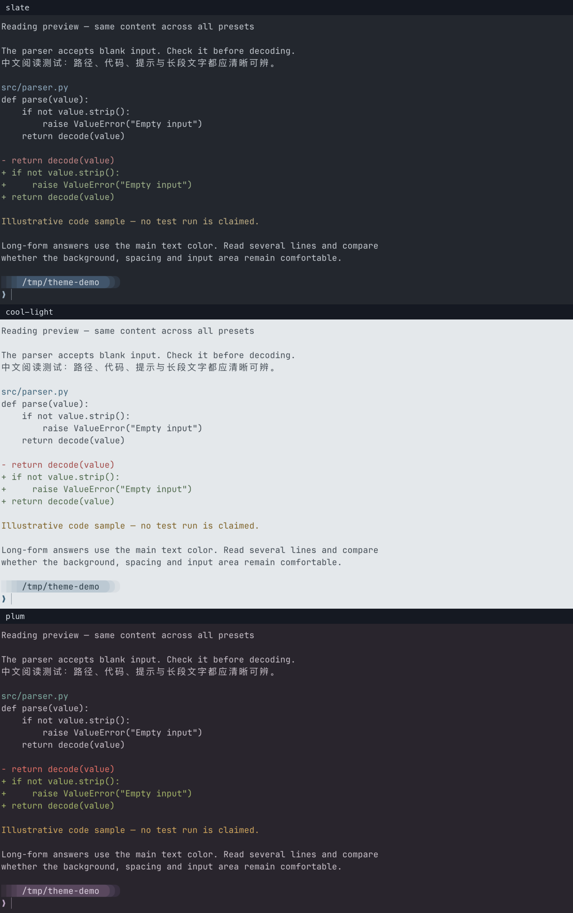

# cmux + Starship Terminal Setup

A personal selection of ready-to-use cmux color themes and Starship prompts. Pick a terminal theme and a prompt style independently, then make the setup your own. Contributions are welcome.

## Two commands

From this repository on macOS:

```sh
./cmux-theme         # choose terminal colors
./starship-theme     # choose a shell prompt
```

Or apply a choice directly:

```sh
./cmux-theme slate
./starship-theme community/10-adithsureshbabu
```

Requires cmux, Python 3.10+, Starship initialized in your shell, and JetBrainsMono Nerd Font Mono. Open a new shell to see the prompt; existing sessions stay open.

Changing cmux colors preserves your selected Starship style, including its own palette. `./starship-theme theme` returns to each terminal theme’s bundled prompt. On a first install, choosing a Starship style without a saved terminal selection also installs Slate.

## A few favorites

Real cmux screenshots, cropped and stacked at full page width for readability. These are selected examples, not every possible combination; click a preview to enlarge it. Original captures remain in [previews/](previews/).

**Terminal colors: Slate, Cool Light, and Plum**



**Starship prompts on Slate: 10, 09, and Tokyo Night**


| Prompt | Full screenshot | Original source |
| --- | --- | --- |
| 10 · pastel bar | [Open](previews/starship/10-adithsureshbabu.png) | [adithsureshbabu](https://github.com/starship/starship/discussions/1107#discussioncomment-13804687) |
| 09 · minimal layout | [Open](previews/starship/09-loganoxo.png) | [loganoxo](https://github.com/starship/starship/discussions/1107#discussioncomment-11363178) |
| Tokyo Night · terminal | [Open](previews/starship/tokyo-night-terminal.png) | [Starship Tokyo Night](https://starship.rs/presets/tokyo-night) |

The menus include 10 terminal themes and 15 community prompts, plus minimal and Tokyo Night alternatives. All community prompts have [author credits and source links](starship/CREDITS.md). Saved favorites: 07, 08, 09, 10, 11, and 15.

## Undo and optional CLI themes

```sh
./cmux-theme restore         # undo the latest terminal or prompt switch
./switch-theme codex        # launch Codex with the selected syntax theme
./switch-theme claude       # launch Claude with the selected custom theme
```

Normal CLI arguments can follow `codex` or `claude`. Existing CLI sessions and global model settings are unchanged. [Real Codex theme-picker example](previews/slate-codex.png); Claude screenshots are not yet included.

Settings backups stay on your machine in `~/.config/cmux/reading-backups/`. Restore refuses to overwrite files edited after a switch. Shared Ghostty settings, credentials, and running jobs are preserved. The original `switch-theme` commands still work.

## Use with an agent

The repository includes the [cmux-terminal-setup skill](.agents/skills/cmux-terminal-setup/SKILL.md), covering inspection, switching, previews, verification, restoration, and customization. It reuses the same scripts rather than duplicating their implementation.

Open the repository in an agent supporting repository skills, then ask:

> Use $cmux-terminal-setup to switch to Cool Light while keeping Starship style 10.

Other agents can read `.agents/skills/cmux-terminal-setup/SKILL.md` directly; `AGENTS.md` points to it. This skill is local to this repository, not globally installed.

## Add your own / contribute

- **Starship:** add a named `.toml` under `starship/`. It appears in the prompt menu automatically.
- **cmux:** copy a directory under `themes/` to a new name, adjust its colors and matching CLI theme names, and keep all seven configuration files. It appears in the terminal menu automatically.
- **Share:** include source/author credits for adapted designs, describe your changes, and add a real screenshot from a clean demo session. Do not include private paths, credentials, or local backups. Pull requests are welcome when repository access is available.

Preview installation without changing your settings:

```sh
python3 tools/install.py my-theme
python3 tools/install.py slate --starship my-style
```

For isolated testing, add `--home /tmp/cmux-theme-test --apply`. Full installation instructions for agents are in the skill. Rebuild the curated screenshot sheets with `python3 tools/build_preview_sheets.py` (requires ImageMagick 7); full originals are retained.
