# cmux + Starship Terminal Setup

Coordinated terminal colors and shell prompt styles for cmux and Starship.

Choose from 10 cmux color themes and independently switch Starship prompt styles. Optional Codex CLI and Claude Code theme launchers are included.

## Switch

On macOS, with cmux and Python 3.10+ installed:

```sh
./switch-theme
```

Pick a number. Your previous settings are backed up automatically. Existing sessions stay open. Starship and the configured JetBrainsMono Nerd Font Mono must already be installed; Starship must be initialized in your shell. Open a new shell to see its prompt.

```sh
./switch-theme slate        # apply directly
./switch-theme restore      # restore previous settings
./switch-theme codex        # start Codex with the selected theme
./switch-theme claude       # start Claude with the selected theme
```

Normal CLI arguments can follow `codex` or `claude`. These launchers do not change global CLI settings. Already-running CLI sessions retain their own theme settings. Restore refuses to overwrite files edited after a switch.

## Starship styles

Terminal themes control cmux colors. **Starship styles** control the shell prompt layout, icons, and information. They can now be selected independently; changing the terminal theme preserves your chosen Starship style.

```sh
./switch-theme starship
./switch-theme starship community/10-adithsureshbabu
./switch-theme starship tokyo-night/terminal
./switch-theme starship theme   # follow each terminal theme's bundled prompt again
```

15 community styles are included with [author credits and original source links](starship/CREDITS.md). Favorites: **07 maths-lover, 08 tungstengmd, 09 loganoxo, 10 adithsureshbabu, 11 mattmc3, 15 danboy**. The `>_` Tokyo Night alternative is saved too. Starship style colors are preserved rather than automatically recolored for light themes.

## Themes

Real cmux screenshots, captured in an isolated `/tmp/theme-demo` workspace with sample code. These are unedited window captures, not rendered mockups. Click an image to view it at full size.

### slate

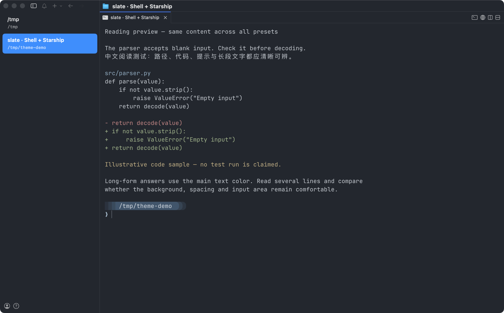

### cool-light

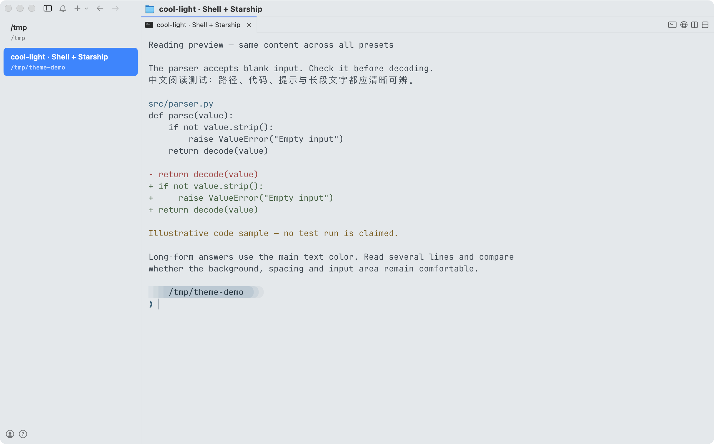

### plum

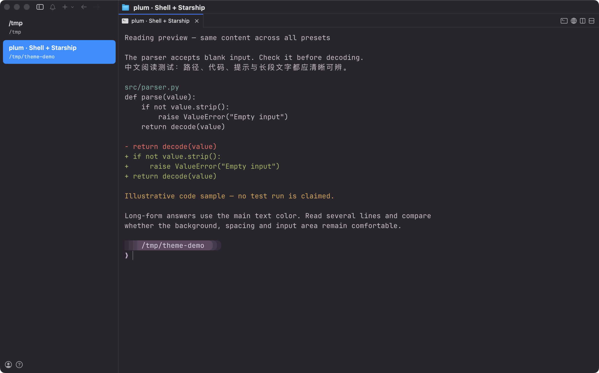

### dark

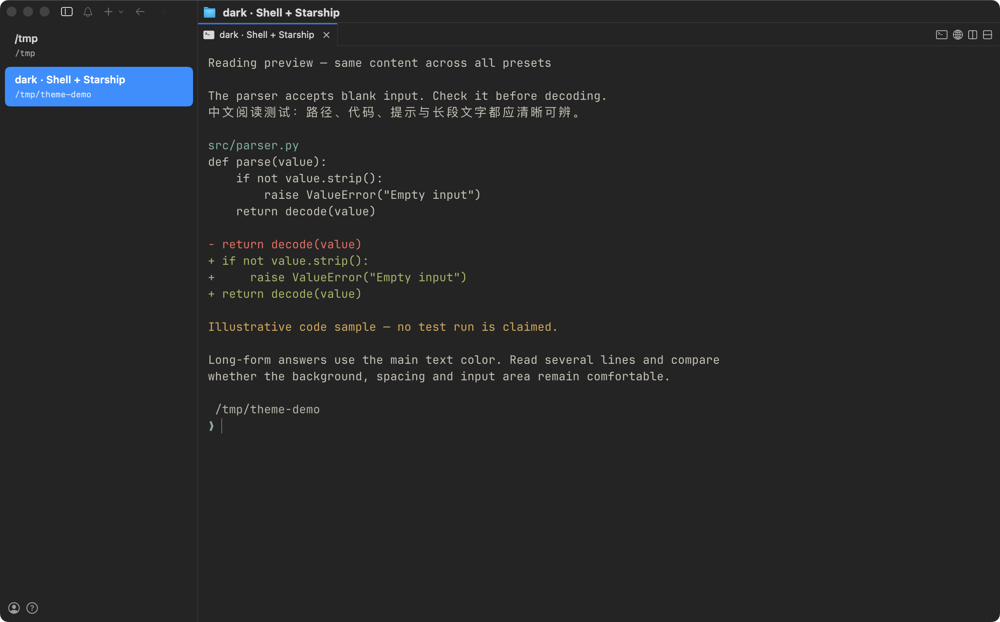

### forest

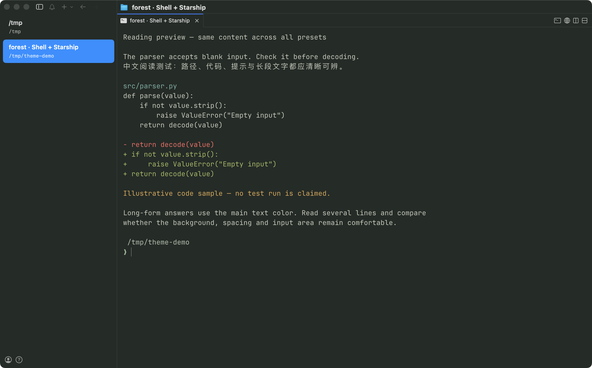

### graphite

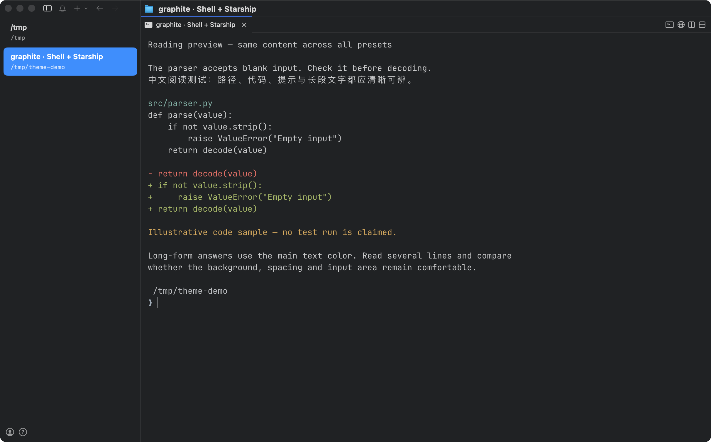

### light

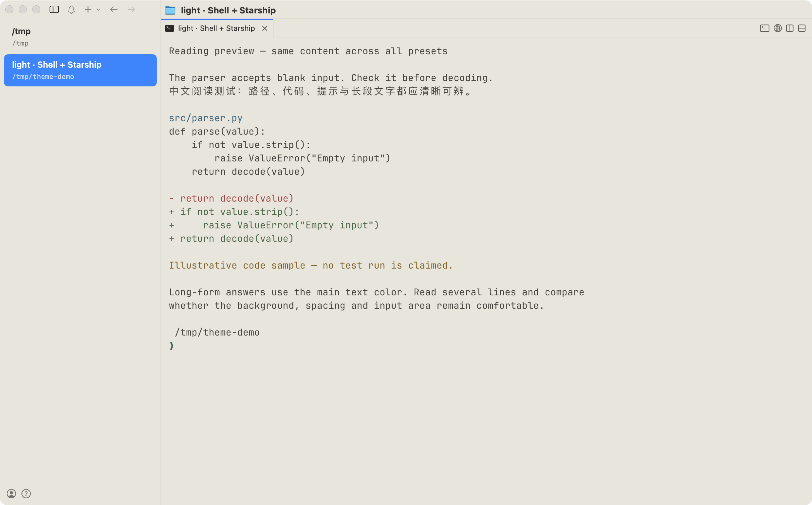

### parchment

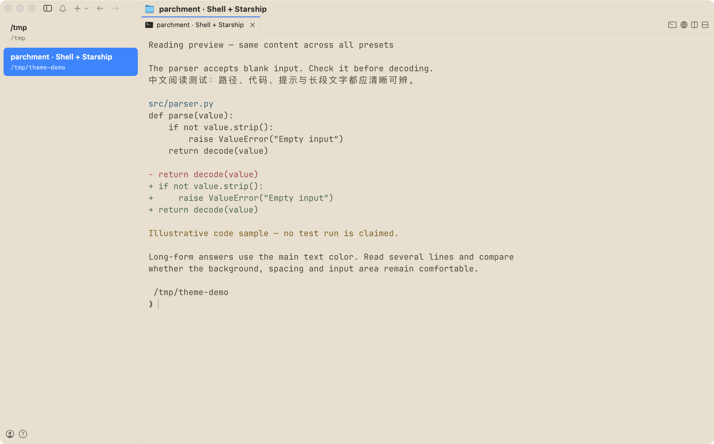

### mist

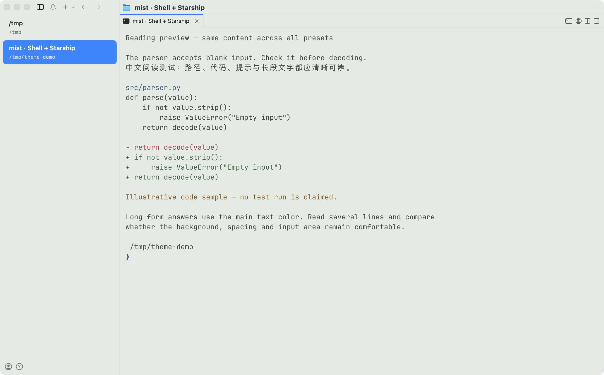

### white

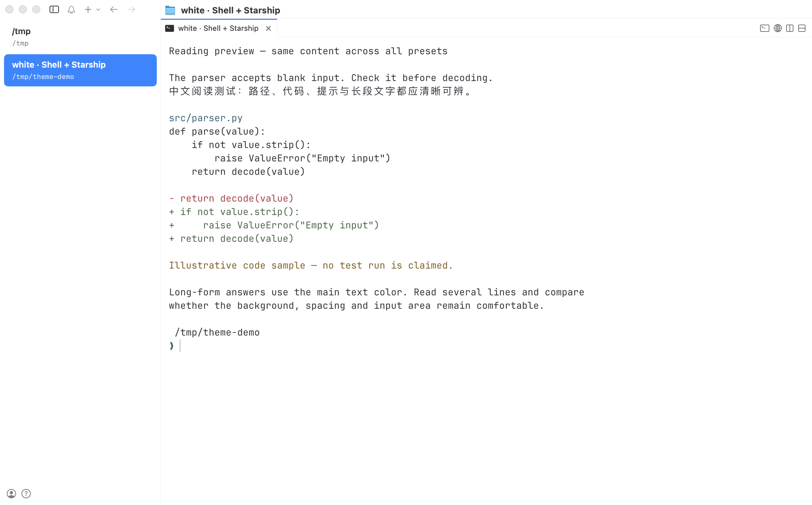

## Codex in cmux

Real Codex CLI theme-picker screenshots showing its built-in sample diff, not a model conversation. Some UI accents are controlled by Codex itself.

| Slate | Cool Light |
| --- | --- |
| 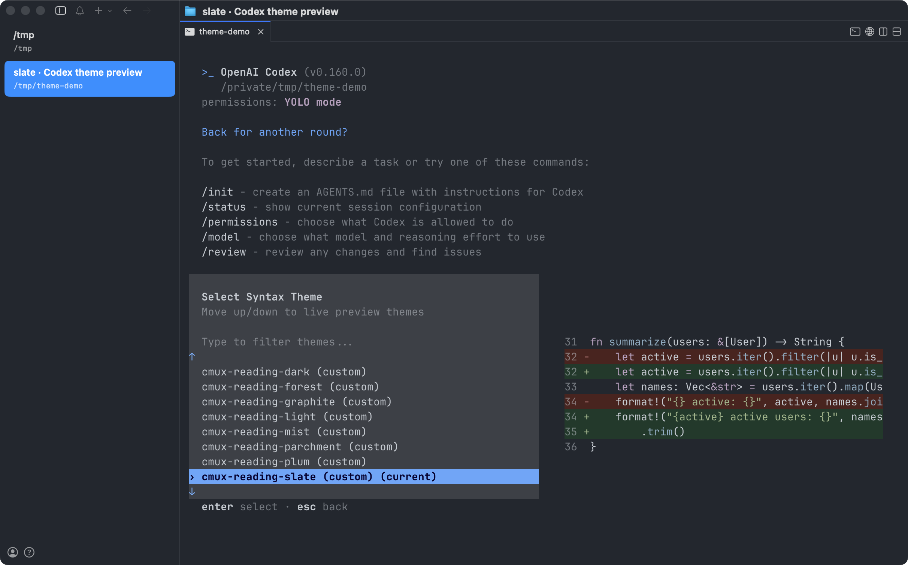 | 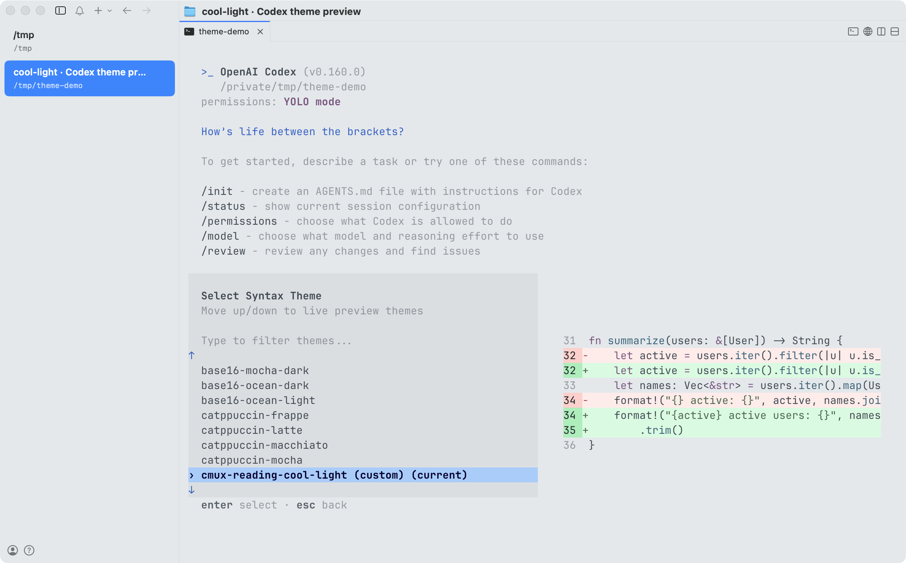 |

Claude theme configs are included, but Claude screenshots are not yet available.

## Files

- `themes/`: ten sets of terminal, prompt, and CLI theme configuration.
- `previews/`: real cmux screenshots shown above.
- `tools/`: switching and CLI launch helpers.
- `starship/minimal/`: optional minimal prompts for Slate, Cool Light, and Plum.

Settings backups stay on your machine in `~/.config/cmux/reading-backups/`; they are never copied into this repository. Only cmux appearance, its prompt selection, and custom CLI theme files are installed. Shared Ghostty settings, model settings, credentials, and running jobs are preserved.
