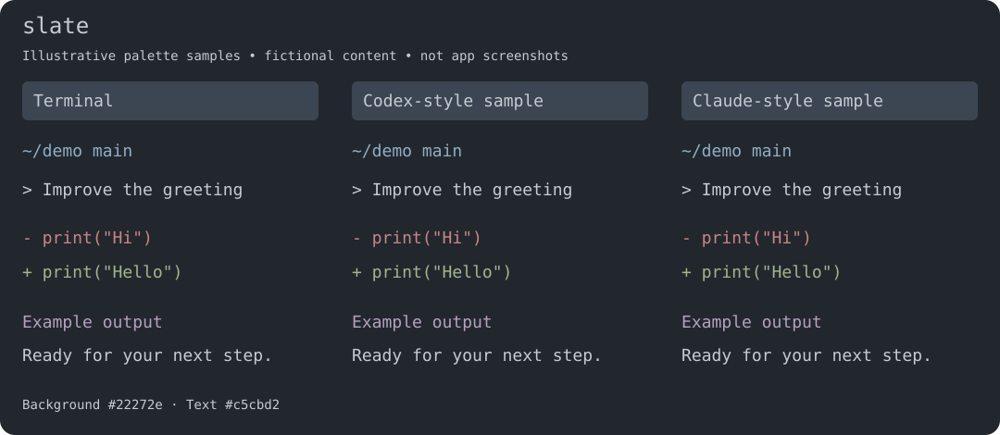
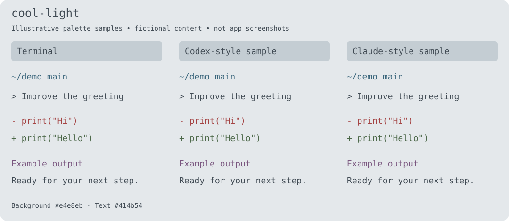
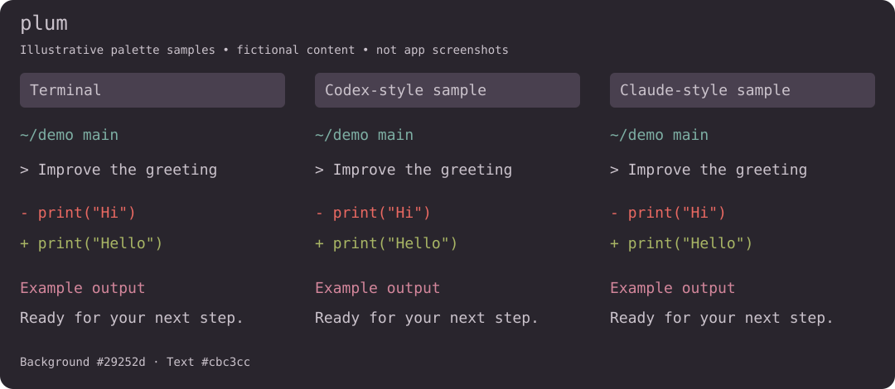
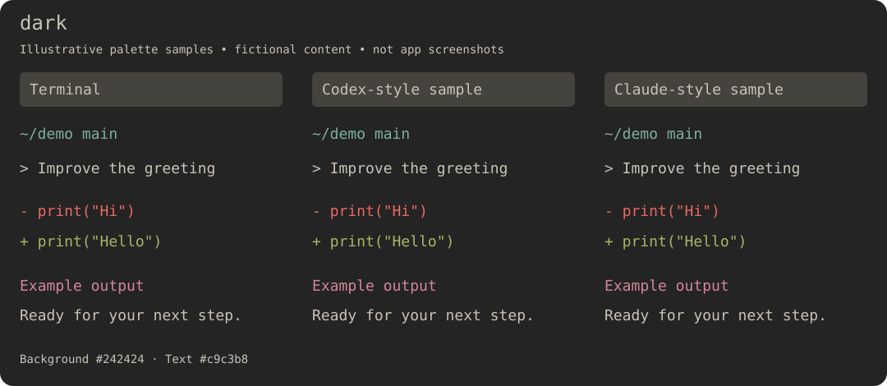
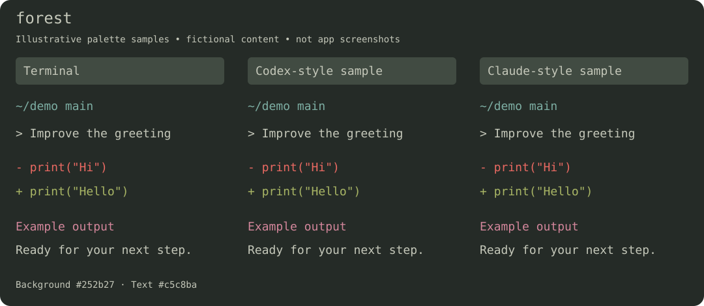
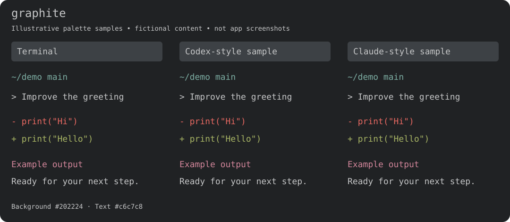
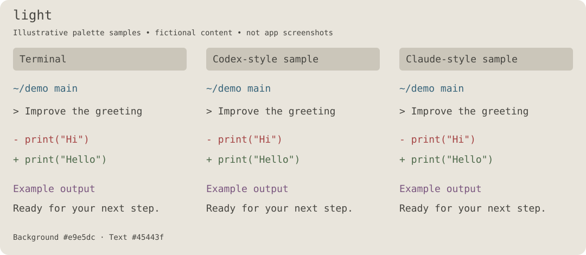
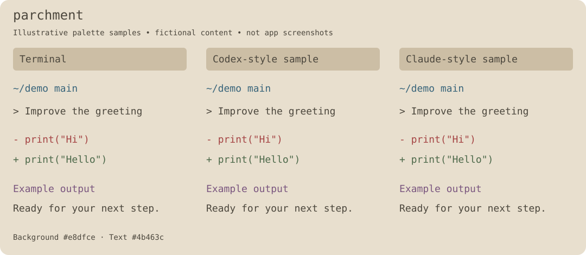
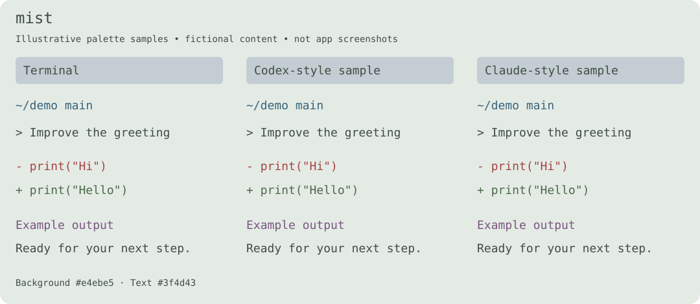
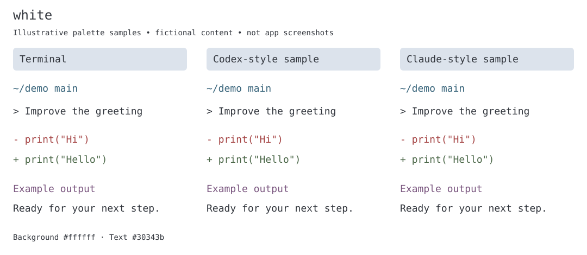

# cmux themes

Ten readable themes for cmux, Starship, Codex CLI, and Claude Code.

## Switch

On macOS, with cmux and Python 3.10+ installed:

```sh
./switch-theme
```

Pick a number. Your previous settings are backed up automatically. Existing sessions stay open. Starship and the configured JetBrainsMono Nerd Font Mono must already be installed; Starship must be initialized in your shell. Open a new shell to see its prompt.

```sh
./switch-theme slate        # apply directly
./switch-theme restore      # restore previous settings
./switch-theme codex        # start Codex with the selected theme
./switch-theme claude       # start Claude with the selected theme
```

Normal CLI arguments can follow `codex` or `claude`. These launchers do not change global CLI settings. Already-running CLI sessions retain their own theme settings. Restore refuses to overwrite files edited after a switch.

## Themes

Figures below are **illustrative palette samples**, not screenshots of the apps. They use fictional `~/demo` content; actual Codex/Claude layout and some UI colors depend on the app version. No personal screenshots or conversations are included.

### slate



### cool-light



### plum



### dark



### forest



### graphite



### light



### parchment



### mist



### white



## Files

- `themes/`: ten sets of terminal, prompt, and CLI theme configuration.
- `previews/`: sanitized sample figures shown above.
- `tools/`: switching and CLI launch helpers.
- `prompt-variants/minimal/`: optional minimal prompts for Slate, Cool Light, and Plum.

Settings backups stay on your machine in `~/.config/cmux/reading-backups/`; they are never copied into this repository. Only cmux appearance, its prompt selection, and custom CLI theme files are installed. Shared Ghostty settings, model settings, credentials, and running jobs are preserved.
